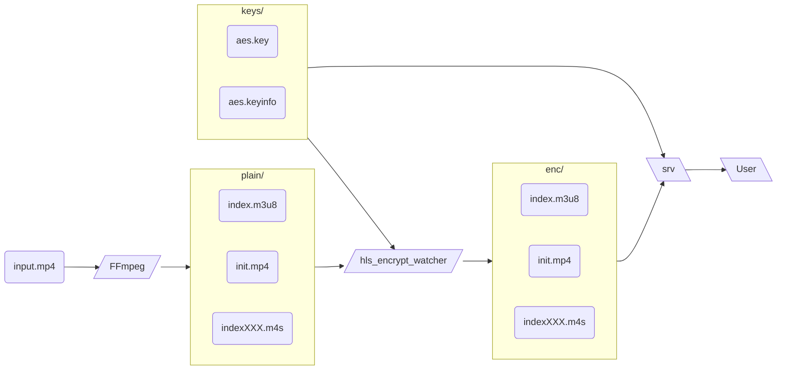

# Encrypted fMP4 HLS using FFmpeg

> [!NOTE]
> **Encrypted fMP4 is not yet supported by FFmpeg**
> ```console
> $ ffmpeg ... -hls_key_info_file ...
> [hls @ 0x7fa44d106340] Encrypted fmp4 not yet supported
> [out#0/hls @ 0x7fa44d110440] Could not write header (incorrect codec parameters ?): Not yet implemented in FFmpeg, patches welcome
> ```

Therefore, this Docker Compose project includes a Python worker that performs the encryption process as a replacement for FFmpeg’s unsupported encrypted fMP4 feature.
In addition, an HLS server is launched to serve the encrypted segments.

(*Sorry, FFmpeg, I owe you a patch someday.*)



## Run

```
export INPUTMP4=/path/to/input.mp4
docker compose up
```

- Open [hls.js demo](https://hlsjs.video-dev.org/demo/?src=http%3A%2F%2Flocalhost%3A8003%2Findex.m3u8&demoConfig=eyJlbmFibGVTdHJlYW1pbmciOnRydWUsImF1dG9SZWNvdmVyRXJyb3IiOnRydWUsInN0b3BPblN0YWxsIjpmYWxzZSwiZHVtcGZNUDQiOmZhbHNlLCJsZXZlbENhcHBpbmciOi0xLCJsaW1pdE1ldHJpY3MiOi0xfQ==) in Browser
