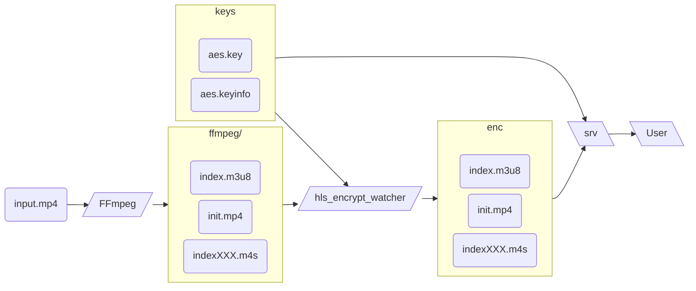

# Secure FMP4 HLS using FFMPEG

```mermaid
%%{init: {"flowchart": {"nodeSpacing": 10, "rankSpacing": 25}} }%%
flowchart LR
    A("input.mp4") --> B[/"FFmpeg"/]

    subgraph C["ffmpeg/"]
      direction LR
      C0[" "]:::invisible
      C1("index.m3u8"):::file
      C2("init.mp4"):::file
      C3("indexXXX.m4s"):::file
    end

    B --> C

    subgraph D["keys"]
      direction LR
      D0[" "]:::invisible
      D1("aes.key"):::file
      D2("aes.keyinfo"):::file
    end

    C --> E[/"hls_encrypt_watcher"/]
    D --> E

    subgraph F["enc"]
      direction LR
      F0[" "]:::invisible
      F1("index.m3u8"):::file
      F2("init.mp4"):::file
      F3("indexXXX.m4s"):::file
    end

    E --> F
    D --> G[\"srv"\]
    F --> G
    G --> H[\"User"\]

classDef invisible fill:none,stroke:none;
```
